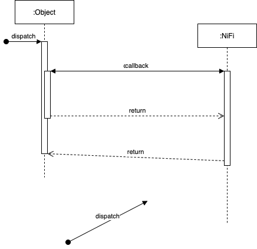

<p align="center">
 
</p>

<div align="center">
	<h1>Data Pipeline 001</h1>
</div>

<p align="center">
 
 
 
 

</p>

<p align="center">
  <a href="#about">About</a> •
  <a href="#installation">Installation</a> •
  <a href="#updating">Updating</a> •
  <a href="#features">Features</a> •
  <a href="#binds">Binds</a> •
  <a href="#wiki">Wiki</a> •
  <a href="#contributing">Contributing</a> •
  <a href="#credits">Credits</a> •
  <a href="#support">Support</a> •
  <a href="#license">License</a>
</p>

## Overview
ACME Inc. is a multinational company operating in the agricultural industry growing and harvesting a variety of commodity grains like wheat, barley, and corn, among others.

As is normally expected from any type of business operation, legal problems are bound to happen, and that is why most companies set up dedicated internal legal department tasked with managing and resolving all these legal issues across the different legal areas: corporate, regulatory, labor and employment, etc. Now, it would be unrealistic for internal legal teams to be able to handle all the potential legal issues across all the practice and regional areas, this is why part of this legal work is normally outsource to external legal firms.

ACME has been keeping track of all the legal cases on their ELM system (Enterprise Legal Management), work outsourced to external legal firms is also tracked there. External vendors are given access to ELM to be able to submit invoices for the work they have performed. These submitted invoices need to be paid by ACME, this is currently a very manual process, but they looking to change that through a series of implementation projects: one of them being the implementation of accounts payable systems in each the three regions they operate in.

ACME has reached out to us to help design and build an integration system to be able to move all the invoice information to the correct accounts payable system so they can be paid automatically to the external legal firms as soon as the invoices have been approved by the internal teams.

The architecture presented here is one of the many potential solutions to this integration problem.

## High-Level Requirements
After meeting with the internal stakeholders (legal and IT) we were able to capture a few interesting requirements:  

* From an integration approach perspective, ACME is managing all other integration via the exchange of flat files, and they would like to keep it this way as they already have an on-premises SFTP server in place that they would like to leverage for this integration as well. This SFTP is currently being used for other integrations as well.
* Dedicated database users need to be created for connection purposes on each database, reuse of existing users is not allowed, nor a good practice.
* The integration jobs shall run on a daily schedule.
* The integration jobs shall check for data completness and consistency.
* A report shall be sent to the legal team if an invoices is not complete or consistent for them to resolve, once resolved invoice will be precessed in the next run.
* The flat files exchanged shall be in .csv format.
* Generated files shall contain a timestamp.
* Files from previous runs shal be removed upon insertion in the corresponding AP system.

## Proposed Architecture
In order to demo how the solution would work we have leveraged Docker and Docker Compose to spin up all the services needed by the solution locally. Note that deploying the solution to a production environment needs careful planning and design, for an idea on how production deployment in AWS would look like see further down below. The reader should be able to clone this repository, run it with docker compose and play around with it.

### TL;DR
* One container with a Postgresql DB server to simulate the source ELM system
* Three containers, each one with a Postgres DB server to simulate the three AP target systems 
* One container with an Apache NiFi server
* One con
* A container with an FTP server will be used to store the flat files

The following deployment diagram outlines all the components of the proposed solution:

<center>
  
*Fig - A single track trail outside of Albuquerque, New Mexico.*
</center>

<center>
  
*Fig - A single track trail outside of Albuquerque, New Mexico.*
</center>


## Technology
***Apache NiFi*** - Apache NiFi provides powerful and scalable directed graphs of data routing, transformation, and system mediation logic.

***Apache NiFi Registry*** - Registry - a subproject of Apache NiF - is a complementary application that provides a central location for storage and management of shared resources across one or more instances of NiFi or MiNiFi.
 
***Apache Zookeeper*** - ZooKeeper is a high-performance coordination service for distributed applications. It exposes common services - such as naming, configuration management, synchronization, and group services - in a simple interface so you don't have to write them from scratch. You can use it off-the-shelf to implement consensus, group management, leader election, and presence protocols. And you can build on it for your own, specific needs.

***PostgreSQL*** - PostgreSQL is a powerful, open source object-relational database system that uses and extends the SQL language combined with many features that safely store and scale the most complicated data workloads.

***pgAdmin*** - PGAdmin is a web-based GUI tool used to interact with the Postgres database sessions, both locally and remote servers as well. You can use PGAdmin to perform any sort of database administration required for a Postgres database.


## How It All Works
Lorem ipsum dolor sit amet, consectetur adipiscing elit. Nam vitae risus id leo tincidunt placerat iaculis sit amet nunc. Aenean mollis sapien eget eros semper porta. Maecenas id nisi ultricies, vestibulum magna vel, elementum lectus. Praesent bibendum vitae est ac aliquam.

<center>
  
*Fig - A single track trail outside of Albuquerque, New Mexico.*
</center>

## Getting Started

* Check Docker and Docker Compose installation

```
// Docker
$ docker --version

// Docker Compose
$ docker-compose --version
```

* Create a shallow clone of this repository

```
$ git clone --depth 1 https://github.com/penzomassimo/integration-pipeline-001
```

* Run Docker Compose to spin up all the containers

```
$ docker-compose up
```

* Restore databases - each database service for this solution comes with a backup file under the `./<service-folder>/backup/` folder that needs to be restored so we can have a working schema

```
// ELM database
$ cat ./postgresdb-svc/backups/backup.sql | docker exec -i postgresdb-svc psql -U admin -d db-1

// AP system 1 database
$ cat ./postgresdb-svc/backups/backup.sql | docker exec -i postgresdb-svc psql -U admin -d db-app-1

// AP system 2 database
$ cat ./postgresdb-svc/backups/backup.sql | docker exec -i postgresdb-svc psql -U admin -d db-app-2

// AP system 3 database
$ cat ./postgresdb-svc/backups/backup.sql | docker exec -i postgresdb-svc psql -U admin -d db-app-3

```  


* Follow the links on the table below to access the corresponding UI for the different components:


| Service Name         | URL                                           |
|-------------------|------------------------------------------------|
| `pgAdmin UI`        | [http://127.0.0.1:8080](http://127.0.0.1:8080) |
| `NiFi Data Flow UI` | `http://127.0.0.1:8091/nifi/` |
| `NiFi Registry UI`  | `http://127.0.0.1:18080/nifi-registry/` |

### Uninstall
* Stop and remove all the containers, networks, volumes and images created by `$ docker-compose up`

```
$ docker-compose down -v
```


## Usage
Use this space to show useful examples of how a project can be used.

## Deployment Approach
The following diagram outlines one of the many approaches we could take to deploy this pipeline in AWS.

A few comments on deployment:

* Review AWS Well Architected Framework

  
*Deployment diagram in AWS*   

## Potential Improvements
Lorem ipsum dolor sit amet, consectetur adipiscing elit. Nam vitae risus id leo tincidunt placerat iaculis sit amet nunc. Aenean mollis sapien eget eros semper porta. Maecenas id nisi ultricies, vestibulum magna vel, elementum lectus. Praesent bibendum vitae est ac aliquam.

* Lorem ipsum dolor sit amet, consectetur adipiscing elit. Nam vitae risus id leo tincidunt placerat iaculis sit amet nunc.
* Lorem ipsum dolor sit amet, consectetur adipiscing elit. Nam vitae risus id leo tincidunt placerat iaculis sit amet nunc.
* Lorem ipsum dolor sit amet, consectetur adipiscing elit. Nam vitae risus id leo tincidunt placerat iaculis sit amet nunc.
* Lorem ipsum dolor sit amet, consectetur adipiscing elit. Nam vitae risus id leo tincidunt placerat iaculis sit amet nunc. 

## References
Here is a list of references and documentation   

* Docker - [Duck Duck Go](https://duckduckgo.com).
* Docker Compose - [Duck Duck Go](https://duckduckgo.com).
* PostgreSQL - [Duck Duck Go](https://duckduckgo.com).


## License
Distributed under the MIT License. See LICENSE file for more information.

## Contact
Massimo Penzo - penzo.massimo@gmail.com


